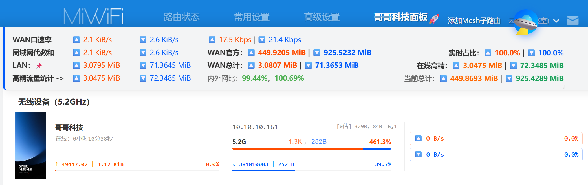
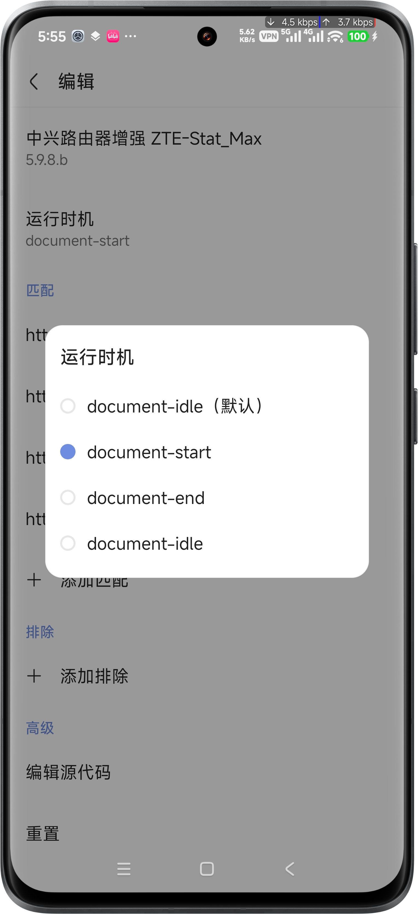
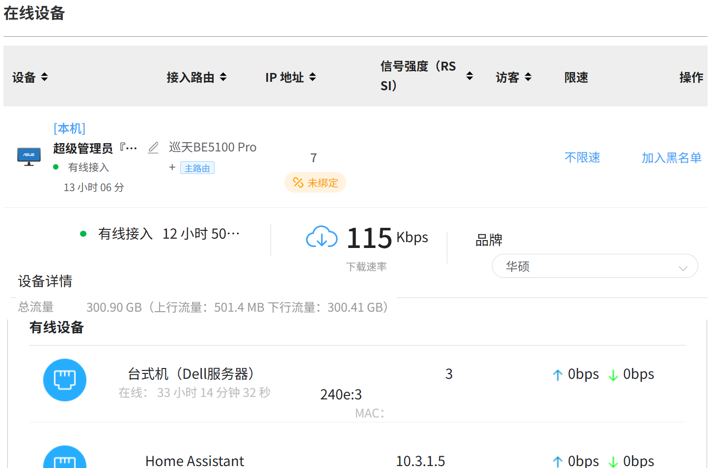

# Mi-Stat_Max@Bro-Tech|哥哥科技

[](https://github.com/ucxn/Mi-Stat_Max)&emsp;&nbsp;
[](https://github.com/ucxn/Mi-Stat_Max/blob/main/LICENSE.md)

[](https://scriptcat.org/zh-CN)&nbsp;&emsp;
[](https://github.com/ucxn/ZTE-Stat_HA)

**English** | [简体中文](README_zh-Hans.md)

**Mi-Stat_Max** (Author: *Brother Tech* / *哥哥科技*) is one of the most important branches of the Bro-Stat_Max series — a xMonkey Script enhancement plugin built specifically for the Xiaomi router Web management dashboard, paired with a dedicated **Home Assistant integration** for smart home connectivity.

Covers the full MiRD router lineup, including the Xiaomi BE3600, BE6500 (including Pro), 10 Gigabit, BE5000, BE7000, AX6000, and more!

Theoretically supports all Wi-Fi 5/6/7 routers running Xiaomi's stock firmware. Nearly all AX-series and newer models deliver comprehensive data. ISP-customized models may only return partial data, but broad compatibility is maintained throughout.

This is far more than a UI enhancement plugin. Driven by *Brother Tech*'s carefully crafted algorithms, it thoroughly processes the raw, dynamic, discrete data the router exposes — producing values as close to ground truth as possible. It corrects the firmware's fake/misleading WAN speed figures (which are actually aggregated from LAN-side MAC statistics rather than measured at the WAN port directly — and the public network always matters more than the internal one), accurately attributes per-device traffic share, and weaves calculus and signal processing directly into the script's logic. Only by reading the source code can you truly appreciate the ingenuity. For a broader and more accessible overview, see the [Design Blueprint](https://github.com/ucxn/BroTech/blob/main/README_EN.md).


### [点击一键安装 Quick Install OnLine (Click)](https://github.com/ucxn/Mi-Stat_Max/#script-installation)&nbsp;&emsp;&nbsp;[](https://www.bilibili.com/video/BV1LZ6yBXESq)

[**Domestic**](https://scriptcat.org/zh-CN/script-show-page/6592)&nbsp;&nbsp;&nbsp;&nbsp;&nbsp;**[International](https://greasyfork.org/zh-CN/scripts/582042)**



**Real-time Monitoring**: Total WAN traffic (3s refresh), per-device speeds (3s interval), and official per-device traffic subtotals since boot — with historical records accessible at any time. *Note: Dual-WAN mode defaults to an aggregated sum, a current limitation rather than a deliberate design choice.*</br>
**Calculus Engine**: True WAN throughput (derived via differentiation) and per-device traffic (via ∫ integration), shown in a dual-track display alongside official router stats — works right when you open the page, no setup needed.</br>
**Data Scopes**: Simultaneously tracks and compares: Official hardware readings (current session only), live device data, and cumulative totals since the page was opened.</br>
**Core Features**: WAN/LAN Ratio with 3-source smart arbitration; event-driven traffic calculation; faster true WAN speed display; unified unit conversion; statistics ready the moment you open the page — no background monitoring session required.</br>
**Dashboard UI**: Shows device name, uptime, IPv4, and connected interface. High-precision upload/download speeds and ratios (dual-color indicators), per-device upload history and current-session download share against total household traffic (independent red/blue progress bars), and live speed bars.

This script rebuilds the UI layout of the "Network Management" and "Connected Devices" pages through a self-contained panel. It introduces trapezoidal integration algorithms, an anomalous traffic radar, and a dual-track traffic alignment display — a purpose-built dashboard for network engineers and power users. Theoretically supports the full Xiaomi Wi-Fi 6/7 router lineup.

Router Web UI Enhancement × Mi Home integration linkage (by *Bro-Tech / 哥哥科技*). Home Assistant plugin integration & UI enhancement, Mi Home companion — full MiWiFi series supported! Separately tracks uplink and downlink traffic per device, displays traffic ratios and upload/download proportions, and actively fights P2P/PCDN upstream leeching. Supports both 1000/1024 base systems and Mbps/GiB units. Enables side-by-side LAN and WAN traffic comparison at the global level. Flat device list for instant big-screen visualization. Everything you need right here — no more jumping between menus...

## ✨ Features

* **🏠 Home Assistant Integration**: Works with the dedicated Brother Tech hub integration to push real-time status updates via Webhooks — cleanly sidestepping the web UI's single-session constraint and enabling stable concurrent monitoring across multiple endpoints. See the brother project (universal): [Mi-Stat_HA](https://github.com/ucxn/ZTE-Stat_HA).
* **Traffic & Ratio Statistics**: Independently tracks uplink and downlink traffic per device, with live traffic ratios, up/down proportions, and LAN/WAN comparisons.
* **Abnormal Upload Monitoring**: Monitors upload/download ratios and visually flags anomalies, actively combating PCDN/P2P upstream leeching.
* **Precise Unit Conversion**: Strictly separates network transmission rates from storage capacity. Supports both base-1000 and base-1024 systems with Mbps/GiB display.
* **Global Data Comparison**: Aggregate statistics and intuitive side-by-side comparison between the internal network (combined LAN totals) and the public network (WAN port).
* **High-Precision Integral Traffic Tracking ⏱️ & UI Grid Refactor 🖥️**: Fully mobile-friendly.
* **Dual-Track Traffic Comparison**: Alongside the router's native historical throughput figures, the script independently runs high-frequency data sampling in the browser to track actual traffic consumed while the page is open. Both figures are displayed side by side for cross-reference, with units normalized to the current session for cleaner change tracking.
* **Customization Support**: Built with network engineering conventions in mind — script-level `CONFIG` variables let you fine-tune the display logic for base-1000 (Mbps) and base-1024 (MiB/s).
* **🛡️ Privacy Protection & UI Optimization**:
  * Automatically masks sensitive MAC addresses and temporary IPv6 addresses during in-place DOM mutation rendering, keeping things safe during screen recording, screenshots, or sharing.
  * Forced bottom-alignment via Flexbox, fixing height inconsistencies introduced by CSS grid layouts.
  * Traceless injection — doesn't disturb the native Vue state machine, keeping browser rendering performance intact.
* **:rainbow: Event-Driven Sampling**: Refines the integration algorithm to prevent miscalculated traffic areas caused by sampling time misalignment or phase offset. Uses network speed change events as the basis for sampling interval boundaries.

## 🔗 Symlinks

[](https://github.com/ucxn/Ban-PCDN_Anti-P2P)
[](https://github.com/ucxn/ZTE-Stat_HA)


## 🚀 Installation Guide

<a href="https://www.bilibili.com/video/BV1PtR7B8ECC" target="_blank">
  
</a>

### Requirements
Before using this script, make sure your browser has a userscript manager extension installed, such as:
* **[Tampermonkey](https://www.tampermonkey.net/)** (Recommended — supports Chrome, Edge, Firefox, Safari)
* **[Violentmonkey](https://violentmonkey.github.io/)**
* **[Greasemonkey](https://www.greasespot.net/)**

### Script Installation
1.  Click here to install the full version of *Mi-Stat_Max*:
   
    **[Install from GitHub](https://github.com/ucxn/Mi-Stat_Max/releases/latest)**&nbsp;&nbsp;&nbsp;&nbsp;&nbsp;&nbsp;**[Install via Greasy Fork](https://greasyfork.org/zh-CN/scripts/582042)**

    [*Install from **ScriptCat** (recommended for China — no VPN required)*](https://scriptcat.org/zh-CN/script-show-page/6592)
 
 
 Brother project fully upgraded with smart integration&nbsp;⇨&nbsp;<a href="https://github.com/ucxn/ZTE-Stat_HA" target="_blank"></a>
    
2. Click **"Install"** or **"Update"** in the Tampermonkey popup.
3. Log into your Xiaomi router's web management dashboard, enter the admin password, then **refresh the page** after logging in and navigate to the **BroTech Panel (哥哥科技面板)**. The script activates automatically.


> [!IMPORTANT]
> **Alternative entry point**: If it isn't working, check the **left sidebar navigation** for **🚀 哥哥科技面板 (BroTech Panel)** and open it from there — functionality is essentially identical.<br> <br>Make sure the **Tampermonkey** extension is running correctly. The extension icon in your browser should show a number. See the image below for how to enable userscript injection.

> [!NOTE]
> **Via Browser (mobile)**: Script/plugin features *not working*?
> <details>
> <summary>👉 Click to view the fix</summary>
> <br>Due to limitations in Via Browser's rendering engine, the default `document-idle` injection timing may fail to trigger correctly.<br>
> <br>Open Via's script management page and change the execution timing to either `document-start` or `document-end`.<br>
>
> 
> </details>
 
> [!TIP]
> If the script still isn't taking effect, refer to the graphic tutorial below:
> 

## 📸 Screenshots

| Normal Xiaomi Plugin | ZTE Plugin Reference | This Plugin |
| :---: | :---: | :---: |
|  |  |  |

## ⚙️ Configuration

The script exposes a global `CONFIG` object at the top for fine-tuning based on your network environment:

```javascript
const CONFIG = {
    calcMode: 1,            // 1: Absolute multiplier mode (Upload/Download ratio), 0: Traditional percentage mode
    ratioExtremeUp: 10,     // Extreme upload threshold (default > 1000% — triggers red ⚠️ alert)
    ratioWarnUp: 0.07,      // Heavy upload threshold (default > 7% — triggers red highlight)
    ratioExtremeDown: 0.01, // Extreme download threshold (default < 1% — triggers blue download multiplier display)
    
    // Physical port and wireless band label map (customize for your router model)
    portMap: {
        "eth1": "Port 1",
        "eth2": "Port 2",
        "eth3": "Port 3",
        "eth4": "Port 4",
        "wl0":  "Wi-Fi 2.4G",
        "wl1":  "Wi-Fi 5.2G",
        "wl2":  "Wi-Fi 5.8G"
    }
};
```

## ⚠️ Notes

* This is a pure frontend data reorganization tool — it does not touch the Xiaomi router's underlying firmware or core configuration.

Running under Tampermonkey, the script deriving precise, real-time traffic figures. All UI changes are applied via DOM Mutation on top of the original CSS framework — native feel, no compatibility compromises.

---
*Authored by Brother Tech*

[](https://star-history.com/#ucxn/Mi-Stat_Max&Date)