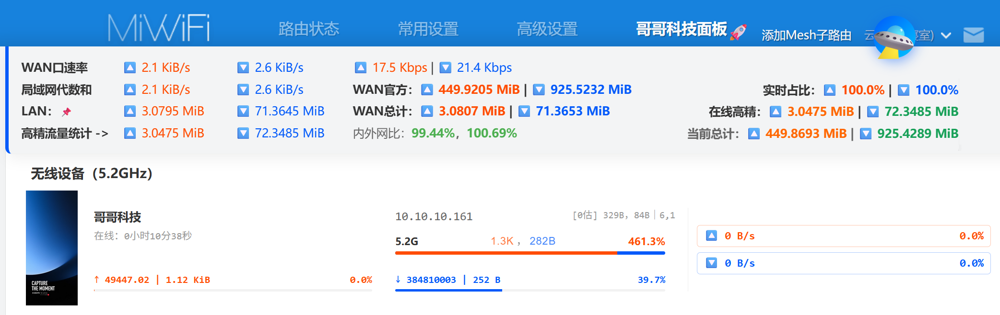
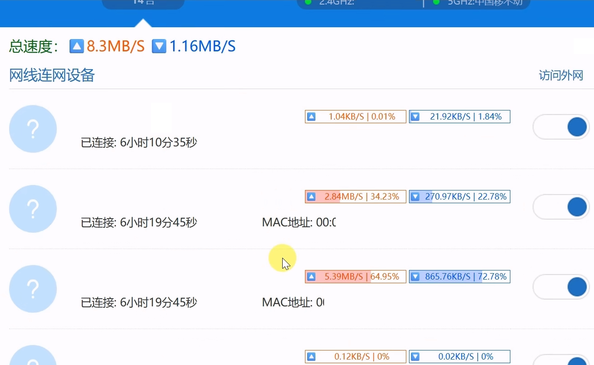
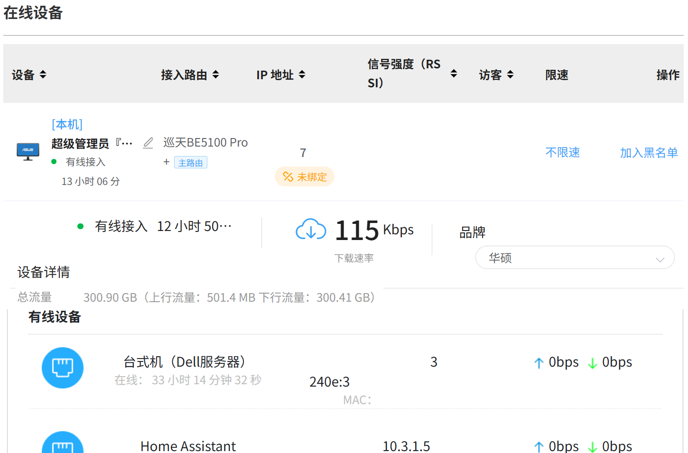

# Mi-Stat_Max@Bro-Tech|哥哥科技

[](https://github.com/ucxn/Mi-Stat_Max)&emsp;&nbsp;
[](https://github.com/ucxn/Mi-Stat_Max/blob/main/LICENSE.md)

[](https://scriptcat.org/zh-CN)&nbsp;
[](https://github.com/ucxn/ZTE-Stat_HA)&emsp;[](https://github.com/ucxn/Brotech)

**English** | [简体中文](README_zh-Hans.md)

**Mi-Stat_Max** (Author: *Brother Tech* / *哥哥科技*) is one of the most important branches of the Bro-Stat_Max series — a xMonkey Script enhancement plugin built specifically for the Xiaomi router Web management dashboard, paired with a dedicated **Home Assistant integration** for smart home connectivity.

Covers the full MiRD router lineup, including the Xiaomi BE3600, BE6500 (including Pro), 10 Gigabit, BE5000, BE7000, AX6000, and more!

Theoretically supports all Wi-Fi 5/6/7 routers running Xiaomi's stock firmware. Nearly all AX-series and newer models deliver comprehensive data. ISP-customized models may only return partial data, but broad compatibility is maintained throughout.

This is far more than a UI enhancement plugin. Driven by *Brother Tech*'s carefully crafted algorithms, it thoroughly processes the raw, dynamic, discrete data the router exposes — producing values as close to ground truth as possible. It corrects the firmware's fake/misleading WAN speed figures (which are actually aggregated from LAN-side MAC statistics rather than measured at the WAN port directly — and the public network always matters more than the internal one), accurately attributes per-device traffic share, and weaves calculus and signal processing directly into the script's logic. Only by reading the source code can you truly appreciate the ingenuity. For a broader and more accessible overview, see the [Design Blueprint](https://github.com/ucxn/BroTech/blob/Brother/README_EN.md).


### [点击一键安装 Quick Install OnLine (Click)](https://github.com/ucxn/Mi-Stat_Max/#script-installation)&nbsp;&emsp;&nbsp;[](https://www.bilibili.com/video/BV1LZ6yBXESq)

[**Domestic**](https://scriptcat.org/zh-CN/script-show-page/6592)&nbsp;&nbsp;&nbsp;&nbsp;&nbsp;**[International](https://greasyfork.org/zh-CN/scripts/598324)**



**Real-time Monitoring**: Total WAN traffic (3s refresh), per-device speeds (3s interval), and official per-device traffic subtotals since boot — with historical records accessible at any time. *Note: Dual-WAN mode defaults to an aggregated sum, a current limitation rather than a deliberate design choice.*</br>
**Calculus Engine**: True WAN throughput (derived via differentiation) and per-device traffic (via ∫ integration), shown in a dual-track display alongside official router stats — works right when you open the page, no setup needed.</br>
**Data Scopes**: Simultaneously tracks and compares: Official hardware readings (current session only), live device data, and cumulative totals since the page was opened.</br>
**Core Features**: WAN/LAN Ratio with 3-source smart arbitration; event-driven traffic calculation; faster true WAN speed display; unified unit conversion; statistics ready the moment you open the page — no background monitoring session required.</br>
**Dashboard UI**: Shows device name, uptime, IPv4, and connected interface. High-precision upload/download speeds and ratios (dual-color indicators), per-device upload history and current-session download share against total household traffic (independent red/blue progress bars), and live speed bars.

This script rebuilds the UI layout of the "Network Management" and "Connected Devices" pages through a self-contained panel. It introduces trapezoidal integration algorithms, an anomalous traffic radar, and a dual-track traffic alignment display — a purpose-built dashboard for network engineers and power users. Theoretically supports the full Xiaomi Wi-Fi 6/7 router lineup.

Router Web UI Enhancement × Mi Home integration linkage (by *Bro-Tech / 哥哥科技*). Home Assistant plugin integration & UI enhancement, Mi Home companion — full MiWiFi series supported! Separately tracks uplink and downlink traffic per device, displays traffic ratios and upload/download proportions, and actively fights P2P/PCDN upstream leeching. Supports both 1000/1024 base systems and Mbps/GiB units. Enables side-by-side LAN and WAN traffic comparison at the global level. Flat device list for instant big-screen visualization. Everything you need right here — no more jumping between menus...

## ✨ Features

* **🏠 Home Assistant Integration**: Works with the dedicated Brother Tech hub integration to push real-time status updates via Webhooks — cleanly sidestepping the web UI's single-session constraint and enabling stable concurrent monitoring across multiple endpoints. See the brother project (universal): [Mi-Stat_HA](https://github.com/ucxn/ZTE-Stat_HA).
* **Traffic & Ratio Statistics**: Tracks the uplink and downlink traffic of individual devices separately, allowing you to view real-time traffic ratio rates and up/down proportions. Adding LAN/WAN Ratio, etc.
* **Abnormal Upload Monitoring**: Detects unusual upload/download ratios and visually flags abnormal uploads, helping pinpoint devices potentially involved in PCDN/P2P upload bandwidth theft.
* **Precise Unit Conversion**: Strictly differentiates between transfer rates and data volumes. Supports both decimal (1000-based) and binary (1024-based) units, including Mbps and GiB.
* **Global Data Comparison**: Supports aggregate statistics and intuitive comparison between the internal network (LAN algebraic sum) and the public network (WAN port).
* **High-Precision Traffic Counting ⏱️ & UI Grid Refactoring 🖥️**：Fully mobile-friendly
* **Dual-Track Traffic Comparison**: In addition to displaying the cumulative traffic totals reported by the router, the frontend independently samples transfer rates at high frequency to estimate traffic usage while the page is open. Both metrics are displayed side-by-side for reference. Units are unified to the current session, focusing on the observability of changes. Special Note: The “high-precision” traffic data here is derived from the official per-MAC cumulative counter, which tracks traffic for each device. However, it has been calibrated to account for issues such as official data rollover and reset, and—unlike the app’s weekly reports—distinguishes between upload and download traffic. The front-end sampling serves as an independent reference to ensure that even during system glitches, users can still view approximate traffic data; the sampling frequency itself does not affect the “high-precision” values.

* **Event-Driven and Group Time**: A new sample is recorded whenever a change is detected in either upload or download speed, so cached readings aren't mistaken for fresh samples. This approach effectively mitigates the issue of varying refresh times across different interfaces and resolves the fallacy that higher polling frequencies lead to less accurate readings when the polling frequency exceeds the refresh frequency. Additionally, the Group Time mechanism significantly reduces the chance of overlap between upload and download sampling frames.
* **Customization Support**: Supports configurable 1000-based Mbps and 1024-based MiB/s displays through script variables, in line with common networking conventions.
* **🛡️ Privacy Protection & UI Optimization**:
  * Automatically masks sensitive MAC addresses and temporary IPv6 addresses during in-place DOM mutation rendering, ensuring safety when screen recording, capturing, or sharing network status.
  * Trace-less injection. Does not break the native Vue state machine, ensuring browser rendering performance.
* **:rainbow: Event-driven**: Optimizes the integration algorithm to prevent miscalculations of flow area caused by misaligned sampling times or phase differences. Uses changes in network speed as the basis for the sampling interval.

## 🔗 Symlinks

[](https://github.com/ucxn/Ban-PCDN_Anti-P2P)
[](https://github.com/ucxn/ZTE-Stat_HA)


## 🚀 Installation Guide

<a href="https://www.bilibili.com/video/BV1LZ6yBXESq" target="_blank">
  
</a>

### Requirements
Before using this script, make sure your browser has a userscript manager extension installed, such as:
* **[Tampermonkey](https://www.tampermonkey.net/)** (Recommended — supports Chrome, Edge, Firefox, Safari)
* **[Violentmonkey](https://violentmonkey.github.io/)**
* **[Greasemonkey](https://www.greasespot.net/)**

### Script Installation
1.  Click here to install the full version of *Mi-Stat_Max*:
   
    **[Install from GitHub](https://github.com/ucxn/Mi-Stat_Max/releases/latest)**&nbsp;&nbsp;&nbsp;&nbsp;&nbsp;&nbsp;**[Install via Greasy Fork](https://greasyfork.org/zh-CN/scripts/598324)**

    [*Install from **ScriptCat** (recommended for China — no VPN required)*](https://scriptcat.org/zh-CN/script-show-page/6592)
 
 
 Brother project fully upgraded with smart integration&nbsp;⇨&nbsp;<a href="https://github.com/ucxn/ZTE-Stat_HA" target="_blank"></a>
    
2. Click **"Install"** or **"Update"** in the Tampermonkey popup.
3. Log into your Xiaomi router's web management dashboard, enter the admin password, then **refresh the page** after logging in and navigate to the **BroTech Panel (哥哥科技面板)**. The script activates automatically.


> [!IMPORTANT]
> **Alternative entry point**: If it isn't working, check the **left sidebar navigation** for **🚀 哥哥科技面板 (BroTech Panel)** and open it from there — functionality is essentially identical.<br> <br>Make sure the **Tampermonkey** extension is running correctly. The extension icon in your browser should show a number. See the image below for how to enable userscript injection.

> [!NOTE]
> **Via Browser (mobile)**: Script/plugin features *not working*?
> <details>
> <summary>👉 Click to view the fix</summary>
> <br>Due to limitations in Via Browser's rendering engine, the default `document-idle` injection timing may fail to trigger correctly.<br>
> <br>Open Via's script management page and change the execution timing to either `document-start` or `document-end`.<br>
>
> 
> </details>
 
> [!TIP]
> If the script still isn't taking effect, refer to the graphic tutorial below:
> 

## 📸 Screenshots

| Normal Xiaomi Plugin | ZTE Plugin Reference | This Plugin |
| :---: | :---: | :---: |
|  |  |  |

## ⚙️ Configuration

The script exposes a global `CONFIG` object at the top for fine-tuning based on your network environment:

```javascript
const CONFIG = {
    readSaveData: 1, // [History] 1: load from router backend (inherit baseline) | 0: fresh start | 2: load from local long-term history [auto-saved!] 
    calcMode: 1, // 1: Absolute multiplier mode (Upload/Download ratio), 0: Traditional percentage mode
    ratioExtremeUp: 10,     // Extreme upload threshold (default > 1000% — triggers red ⚠️ alert)
    ratioWarnUp: 0.12,      // Heavy upload threshold (default > 12% — triggers red highlight)
    ratioExtremeDown: 0.01, // Extreme download threshold (default < 1% — triggers blue download multiplier display)
    lanRefreshInterval: 3, // LAN refresh interval (seconds). Also used in some cases to compensate for traffic between the evaluation point (0) and wake-up
    wanRefreshInterval: 3, // [WAN] refresh interval (seconds). Usually the program's main clock cycle
    周期类型: 'W', // （cycleType）'M' (monthly), 'W' (weekly), 'D' (every N days). Any other value disables periodic reset + auto export
    周_天设置: 5, //（cycleDay/Date） M: day of month (1-31); W: day of week (0-6, Sun-Sat); D: interval in days (e.g. 7)
    基准日期: '2026-09-30', // Anchor date (D mode only): midnight of any past cycle start
    报告时间: 720, // Reminder time: offset in minutes from the cycle start (e.g. -4320 = 3 days early). Relative to the next cycle start after the given date
    自动导出: +1020, // Forced export: offset in minutes from the cycle start (e.g. W mode + day 6 (Sat) + -180 = force export and reset on Friday 21:00)
    时区补偿: 28800000, // Timezone offset in ms. Defaults to UTC+8
    portMap: {
        "eth1": "Port 1",
        "eth2": "Port 2",
        "eth3": "Port 3",
        "eth4": "Port 4",
        "wl0":  "Wi-Fi 2.4 GHz",
        "wl1":  "Wi-Fi 5.2 GHz",
        "wl2":  "Wi-Fi 5.8 GHz"
    }
};
```

## ⚠️ Notes

* This is a pure frontend data reorganization tool — it does not touch the Xiaomi router's underlying firmware or core configuration.

Running under Tampermonkey, the script deriving precise, real-time traffic figures. All UI changes are applied via DOM Mutation on top of the original CSS framework — native feel, no compatibility compromises.

## © Copyright 哥哥科技
1. 始终保留完整的“哥哥科技”字样，并显著地显示在最终用户界面当中，源码里面署名并不构成完成有效署名义务。
Always retain the complete text “哥哥科技”. Even if it is prominently displayed in the end-user interface, an attribution in the source code does not fulfill the obligation to provide a valid attribution.
2. “哥哥科技”是本项目的核心作者署名，BroTech、GitHub 用户名、项目名称或链接只能作为补充，不能替代。
“哥哥科技” is the core author attribution of this project. BroTech, GitHub usernames, project names, or links may supplement it, but may not replace it.
3. 源码、许可证、元数据及其他能够保存文字的载体中，不得删除、改写或替换“哥哥科技”。
In source code, license files, metadata, and other media capable of preserving text, “哥哥科技” must not be removed, rewritten, or replaced.
4. 在原项目中，署名必须保持在作者设计的原有界面位置和层级。任何二次开发均不得将其移动至更深的功能层级，亦不得以任何方式降低其原有的显示、可见性或显著程度。
In the original project, the attribution must remain at the original interface position and depth designed by the Author. No derivative work may move it to a deeper functional level or in any way reduce its original degree of display, visibility, or prominence.
5. 集成到更大作品时，可以增加宿主自身的外层页面或导航层级，但署名相对于本软件所对应的功能，其界面层级不得下降。
When integrated into a larger work, the host may add outer pages, modules, or navigation levels around the function provided by this software, but may not add further attribution depth within the interface corresponding to that function. The attribution's relative position to the function provided by this software must not be reduced in any respect.
6. 当最终用户进入由本软件提供或主要由本软件构成的功能或模块时，“哥哥科技”必须直接显示在该功能或模块的用户界面中，并保持原有的显示位置、显示方式及显著程度。
When an end user enters a function or module provided by or primarily built upon this software, “哥哥科技” must be directly displayed within that function or module's user interface, while retaining its original position, presentation, and prominence.
7. 不得将署名从其对应功能界面移入与该功能无直接对应关系的“关于”“许可证”“第三方组件”或其他次级页面；不得通过折叠、隐藏、额外点击、二级菜单或其他信息架构方式使用户必须离开该功能界面后才能看到署名。
The attribution should not be moved away from the function it identifies or placed in unrelated “About,” “Licenses,” or “Third-Party Components” pages, nor should it be made less visible through collapsing, hiding, or deliberate visual weakening.
8. 集成或改造时，应优先保持原有的显示方式；宿主界面确实需要适配时，可以调整布局，但不得降低原有的显著程度或相对层级。
During integration or adaptation, the original presentation should be preserved whenever practical. Where host-interface adaptation is necessary, the layout may change, but the original prominence and relative depth must not be reduced.
9. 署名要求具有最高优先级；任何违反署名要求的行为都会立即终止本项目授予的相关授权，不受其他期限、宽限期或补救安排影响。
The attribution requirements have the highest priority. Any violation immediately terminates the applicable rights granted under this project, regardless of any other period, cure period, or remedial arrangement.
10. 本总览用于快速理解与实施；完整权利、义务及授权条件以随项目发布的完整许可证文本为准。
This summary is intended for quick understanding and implementation. The complete license texts published with the project govern the full rights, obligations, and licensing conditions.

---
*Authored by Bro-Tech*

[](https://star-history.com/#ucxn/Mi-Stat_Max&Date)
